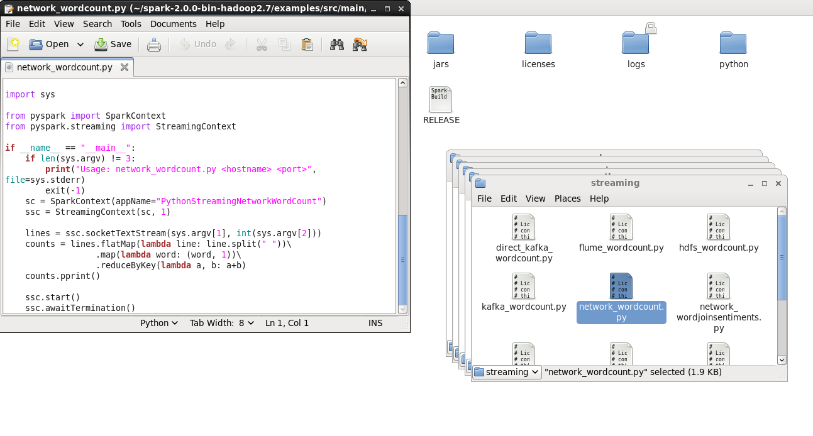
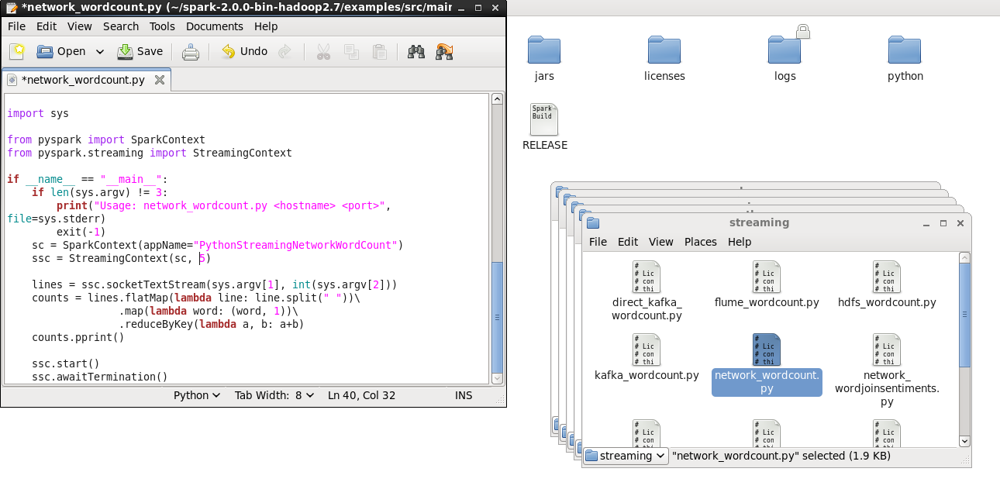
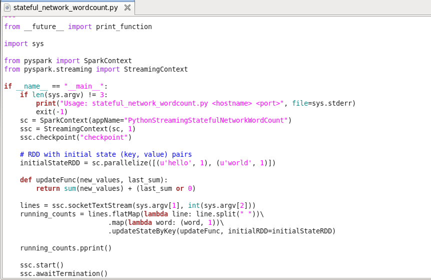

# Metode 1: Mode Stateless Stream Processing
## mengecek file network_wordcount di cloudera
  

## mengganti file network_wordcount dengan interval 5 detik
  

## mengganti file stateful_network_wordcount 
  

## add nama dan nim 
  

## hasil tampilan 
  

## running program add kalimat
  

# Tugas Praktikum
## Silakan selesaikan praktikum tersebut sesuai langkah-langkah sebelumnya, lalu laporkan hasilnya berupa link repository GitHub dengan nama spark-streaming disertai dengan screenshot hasilnya.

## Jelaskan perbedaan spark streaming dengan metode stateless dan stateful stream processing ?

## Jelaskan masing-masing maksud kode berikut sesuai nomor kodenya pada laporan praktikum Anda!
### 1. sys.argv: Variabel dalam modul sys pada Python yang berisi daftar argumen baris perintah yang diberikan saat menjalankan skrip Python. Ini memungkinkan Anda untuk mengakses argumen tersebut dalam kode Python Anda.
### 2. sys.stderr: Objek file standar yang digunakan untuk menulis keluaran kesalahan (error) pada program Python.
### 3. StreamingContext: Kelas dalam Apache Spark Streaming yang menyediakan konteks untuk pengolahan streaming data. Ini memungkinkan pengguna untuk mengatur sumber streaming, interval waktu, dan operasi pemrosesan lainnya.
### 4. sc: Variabel yang biasanya digunakan dalam Apache Spark untuk mewakili konteks Spark. Ini digunakan untuk berinteraksi dengan lingkungan Spark, seperti membuat RDD (Resilient Distributed Dataset) dan menjalankan operasi pada RDD tersebut.
### 5. socketTextStream: Fungsi dalam Apache Spark Streaming yang digunakan untuk membuat aliran teks yang berbasis socket. Ini membaca data dari socket dan mengonversinya menjadi aliran DStream (Distributed Stream) yang dapat diolah.
### 6. reduceByKey: Operasi pada RDD dalam Apache Spark yang menggabungkan nilai-nilai dengan kunci yang sama menggunakan fungsi pengurangan (reducer).
### 7. lambda line: Ekspresi lambda dalam Python yang digunakan untuk membuat fungsi anonim. Dalam kasus ini, line adalah parameter yang digunakan oleh fungsi lambda untuk mengolah setiap elemen dalam RDD atau DStream.
### 8. awaitTermination: Metode dalam Apache Spark Streaming yang digunakan untuk meminta program menunggu sampai pemrosesan streaming selesai sebelum keluar. Metode ini sering digunakan dalam aplikasi streaming untuk menjaga agar program tetap berjalan dan tidak berhenti secara prematur.
### 9. nc: Merupakan singkatan dari "netcat" dan mengacu pada utilitas baris perintah yang digunakan untuk membangun koneksi TCP/IP. Biasanya digunakan dalam konteks streaming untuk mendemonstrasikan aliran data dari server socket ke klien.
### 10. lk: Mungkin merupakan singkatan dari "lock" yang mengacu pada mekanisme sinkronisasi dalam pemrograman yang digunakan untuk mengatur akses bersama ke sumber daya bersama. Namun, tanpa konteks yang lebih jelas, sulit untuk memberikan penjelasan yang pasti.
### 11. spark-submit: Perintah baris perintah yang digunakan untuk mengirimkan aplikasi Spark ke cluster Spark untuk dieksekusi.
### 12. master: Parameter yang digunakan dalam perintah spark-submit untuk menentukan alamat master Spark yang akan digunakan untuk menjalankan aplikasi.
### 13. local[*]: Nilai yang digunakan dalam parameter master untuk menunjukkan bahwa aplikasi Spark harus dijalankan pada satu mesin lokal dengan menggunakan semua core yang tersedia.
### 14. ssc.checkpoint: Metode dalam StreamingContext Apache Spark Streaming yang digunakan untuk mengatur checkpoint untuk fault tolerance. Checkpoint adalah proses menyimpan keadaan streaming context ke penyimpanan yang tahan lama, seperti Hadoop Distributed File System (HDFS).
### 15. parallelize: Metode dalam SparkContext Apache Spark yang digunakan untuk membuat RDD (Resilient Distributed Dataset) dari koleksi yang ada dalam memori komputer.
### 16. updateStateByKey: Operasi pada DStream Apache Spark Streaming yang menggabungkan nilai baru dengan nilai sebelumnya menggunakan fungsi penggabungan (updater). Ini memungkinkan Anda untuk melacak dan memperbarui status yang ada dari batch ke batch.
### 17. flatMap: Transformasi pada RDD dalam Apache Spark yang menghasilkan elemen baru dengan mengaplikasikan fungsi pada setiap elemen input dan mengembalikan nol atau lebih hasil.
### 18. rdd.take(5): Metode dalam RDD Apache Spark yang mengembalikan n elemen pertama dari RDD. Dalam kasus ini, metode ini mengembalikan 5 elemen pertama dari RDD.
### 19. transform: Metode dalam DStream Apache Spark Streaming yang digunakan untuk menerapkan transformasi pada setiap batch DStream. Transformasi ini didefinisikan dengan menggunakan fungsi lambda atau fungsi lainnya.
### 20. rdd.sortByKey(False): Metode dalam RDD Apache Spark yang mengurutkan elemen RDD berdasarkan kunci. Dalam kasus ini, False menunjukkan bahwa pengurutan dilakukan secara menurun (descending order).

